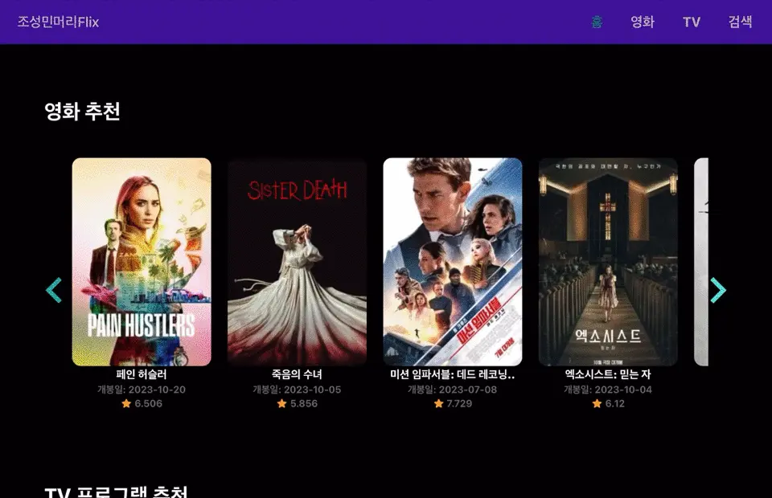
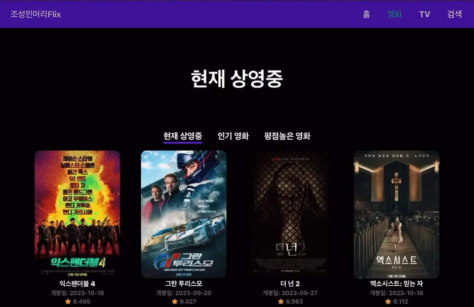
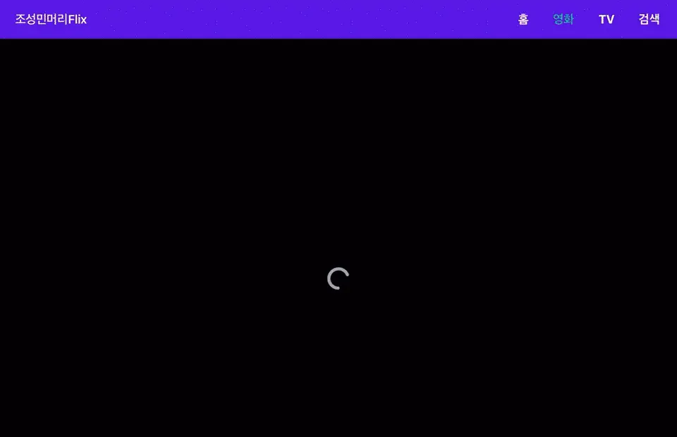
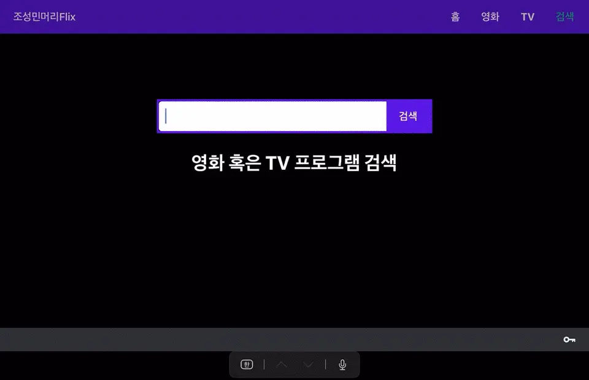

# 🎬영화앱

https://josungminmeoriflix.vercel.app/home

## 📚 사용 스택

## 💡기능들

### **Home 페이지**

- Daily Trending 영화, TV프로그램 추천

### **영화 페이지**

- 현재 상영중, 인기 영화, 평점높은 영화 나열

### **TV 페이지**

- 오늘 방영, 현재 방영중, 인기 프로그램, 평점높은 프로그램 나열

### **검색 페이지**

- 영화 혹은 TV프로그램 검색

### **상세 페이지**

- 영화, TV프로그램 상세정보 표시

